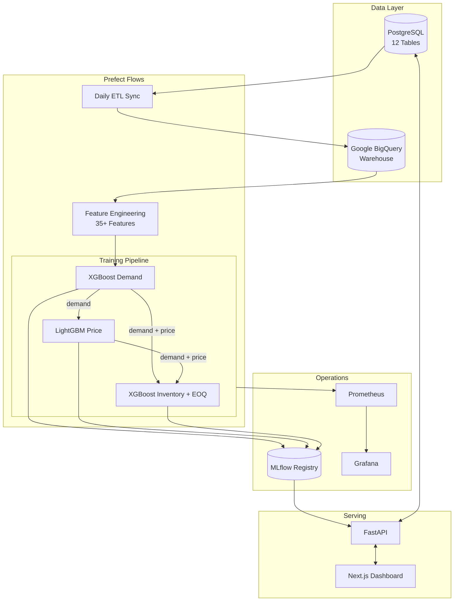

# 🛒 SmartShelf AI

**Production-grade MLOps platform for retail demand forecasting, dynamic pricing, and inventory optimization.**

SmartShelf chains three tightly-coupled ML models — XGBoost Demand Forecasting → LightGBM Price Optimization → Inventory EOQ — into a single automated pipeline that runs weekly via Prefect, tracks versions in MLflow, and serves predictions through a FastAPI backend to a Next.js dashboard.

---

## Architecture



---

## Features

| Module | What It Does |
|--------|-------------|
| **Dashboard** | Live KPIs, revenue trends, and category breakdown from PostgreSQL |
| **Products Admin** | Full CRUD with search, category filters, margin calculations |
| **Predictions Lab** | Run demand forecasting + price optimization for any product-store pair |
| **Critical Stock Center** | Auto-detect low-stock items, bulk-generate predictions, download PDF report |
| **Sales Simulator** | Inject test transactions to validate model behavior under drift |
| **Admin Panel** | Live MLflow model registry, system health, external data sync |
| **Monitoring** | Prometheus metrics + Grafana dashboards for API performance |

---

## Tech Stack

| Layer | Technology |
|-------|-----------|
| Frontend | Next.js 16, TypeScript, Recharts |
| Backend | FastAPI, Python 3.12, SQLAlchemy, Pydantic |
| Database | PostgreSQL (OLTP), Google BigQuery (Warehouse) |
| ML | XGBoost, LightGBM, Scikit-learn |
| MLOps | MLflow (Registry/Tracking), Prefect (Orchestration) |
| Monitoring | Prometheus, Grafana |
| CI/CD | GitHub Actions, Docker |

---

## Quick Start

```bash
# Clone
git clone https://github.com/ParthDhengle/smartshelf-mlops.git
cd smartshelf-mlops

# Backend setup
python -m venv venv && .\venv\Scripts\activate   # Windows
pip install -r requirements.txt && pip install -e .

# Configure .env
# DATABASE_URL=postgresql://postgres:<password>@localhost:5432/smartshelf
# MLFLOW_TRACKING_URI=http://localhost:5000

# Start backend
$env:PYTHONPATH="src"
mlflow ui &
uvicorn smartshelf.api.main:app --host 0.0.0.0 --port 8000 --reload

# Start frontend
cd frontend && npm install && npm run dev

# Train models (required for predictions)
python src/smartshelf/flows/training_flow.py

# Optional: Monitoring
docker-compose -f docker-compose.monitoring.yml up -d
```

---

## Project Structure

```
smartshelf-mlops/
├── .github/workflows/        # CI (test/lint) + CD (train/deploy)
├── frontend/                 # Next.js TypeScript dashboard
│   ├── app/                  # Route pages
│   ├── components/           # Reusable components
│   └── lib/api.ts            # API client
├── src/smartshelf/
│   ├── api/                  # FastAPI app
│   │   ├── routers/          # Domain-driven route modules
│   │   └── schemas/          # Pydantic models
│   ├── flows/                # Prefect orchestration
│   ├── pipelines/            # ML training + feature engineering
│   ├── monitoring/           # Prometheus metrics
│   └── config.py             # Centralized config
├── prometheus/               # Prometheus config
├── grafana/                  # Grafana provisioning
├── Dockerfile
├── docker-compose.monitoring.yml
└── requirements.txt
```

---

## ML Models

### Demand Forecasting (XGBoost)
- 35+ features: temporal lags, rolling statistics, weather, economic indicators
- Predicts daily unit sales per product-store pair

### Price Optimization (LightGBM)
- Uses predicted demand as input feature
- Grid-searches optimal price maximizing `(price - cost) × demand`

### Inventory Optimization (XGBoost + EOQ)
- Combines demand + price predictions with supplier lead times
- Outputs: Reorder Point, Safety Stock, Economic Order Quantity

---

## Pipeline Execution

```bash
# Manual trigger
python src/smartshelf/flows/training_flow.py

# Automated (Prefect deployment)
prefect server start
prefect deployment build src/smartshelf/flows/training_flow.py:weekly_training_flow \
  -n weekly-training -q default --cron "0 4 * * 0"
prefect deployment apply weekly_training_flow-deployment.yaml
prefect agent start -q default
```

---

## API Documentation

With the backend running, visit `http://localhost:8000/docs` for the full Swagger UI.

Key endpoints:
| Endpoint | Method | Description |
|----------|--------|-------------|
| `/health` | GET | System health check (DB + MLflow) |
| `/metrics` | GET | Prometheus metrics |
| `/api/v1/dashboard/kpis` | GET | Live KPI aggregations |
| `/api/v1/products` | GET/POST | Product CRUD |
| `/api/v1/predict-demand` | POST | Demand forecasting |
| `/api/v1/optimize-price` | POST | Price optimization |
| `/api/v1/full-pipeline` | POST | Run all 3 models in sequence |
| `/api/v1/admin/model-registry` | GET | Live MLflow model versions |
| `/api/v1/inventory` | GET | Inventory with product names |

---

## Deployment

- **Frontend**: Vercel (`NEXT_PUBLIC_API_URL` env var)
- **Backend**: Docker → AWS EC2 / EKS
- **Database**: Amazon RDS / Cloud SQL
- **Monitoring**: Prometheus + Grafana via Docker Compose

See [next_steps.md](next_steps.md) for detailed deployment instructions.

---

*Built by Parth Dhengle*
