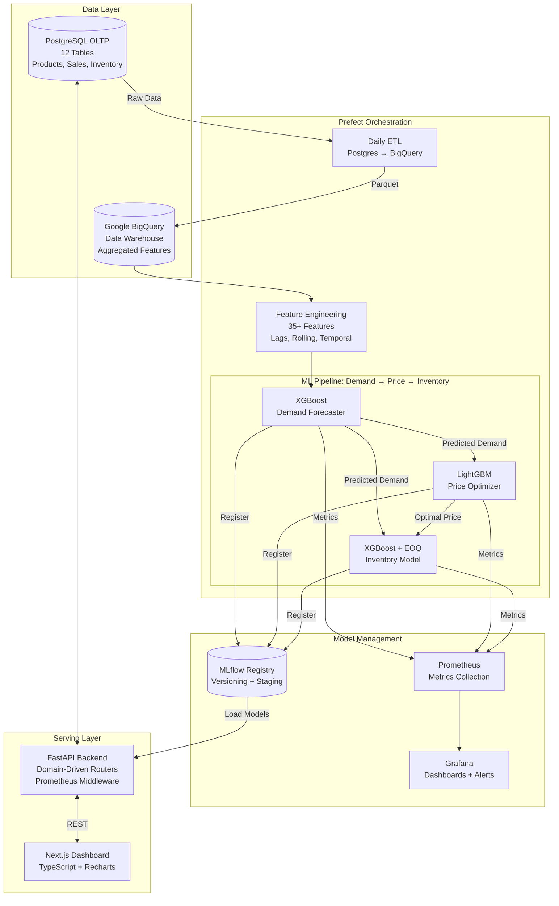

# 🛒 SmartShelf AI — Production-Grade Retail MLOps Platform

<p align="center">
  <strong>End-to-end MLOps ecosystem for demand forecasting, dynamic pricing, and intelligent inventory restocking</strong>
</p>

---

## 🎯 What is SmartShelf?

SmartShelf is a **production-grade Retail AI system** that chains three tightly-coupled Machine Learning models to solve the three biggest problems in retail:

| Problem | Cost to Retail Industry | SmartShelf Solution |
|---------|------------------------|-------------------|
| **Overstocking** | ₹4.7L Cr/year globally in wasted inventory | AI-driven Inventory Optimization with EOQ |
| **Stockouts** | 4% revenue loss per incident | 7-day demand forecasting with XGBoost |
| **Mispricing** | 15-30% margin erosion | LightGBM price elasticity optimization |

### How would people actually use this?

A **supermarket chain manager** opens the SmartShelf dashboard every morning. Instead of manually checking 10,000 SKUs:
1. The system automatically flags items about to stockout
2. For each flagged item, AI predicts exactly how many units will sell in the next 7 days
3. It recommends the optimal price to maximize profit during the restock window
4. It calculates the exact reorder quantity considering supplier lead times

**One click. Three ML models. Zero guesswork.**

---

## 🏗 System Architecture



---

## 📋 Presentation Walkthrough (Step-by-Step)

Follow this exact sequence to demo SmartShelf:

### Step 1: Dashboard (Home Page)
**Navigate to:** `http://localhost:3000/`

**What to show:** 
- 8 live KPI cards (Revenue, Profit, Margin, Stockout Rate) — all pulled from PostgreSQL in real-time
- Revenue Trend chart (30-day sales aggregation from the database)
- Category Distribution pie chart (revenue share per product category)

**What to say:**
> "This is SmartShelf's command center. Every number you see is being queried live from our PostgreSQL database — nothing is hardcoded. The dashboard gives a store manager an instant pulse on revenue, profitability, and stock health."

---

### Step 2: Products Admin
**Navigate to:** `http://localhost:3000/products`

**What to show:**
- Full CRUD operations: Create, Read, Update, Delete products
- Category filtering, search, and live margin calculations
- Show the data flowing from PostgreSQL

**What to say:**
> "This is our product management interface. All 189 products across 10 categories are pulled live from PostgreSQL. A manager can add new SKUs, modify pricing, and the system instantly recalculates margins."

---

### Step 3: The ML Predictions Lab
**Navigate to:** `http://localhost:3000/predictions`

**What to show:**
- Enter a Product ID (e.g., 5) and Store ID (e.g., 1) with today's date + 7 days
- Click **"🧠 Run Predictions"**
- Show the demand forecast chart and optimal price recommendation

**What to say:**
> "This is our ML sandbox. When I click Run Predictions, the system calls our FastAPI backend which loads the trained XGBoost model from the MLflow registry and generates a day-by-day demand forecast. Simultaneously, our LightGBM pricing model calculates the profit-maximizing price. Both models work together — the price model actually uses the demand prediction as an input feature."

---

### Step 4: Critical Stock Action Center ⭐ (The Star Feature)
**Navigate to:** `http://localhost:3000/inventory`

**What to show:**
- Items automatically flagged as below reorder point (pulled from DB)
- Click **"🧠 Analyze & Predict"** on any critical item
- Show the full AI Pipeline result card with 8 KPI metrics

**What to say:**
> "This is where SmartShelf proves its real-world value. The system continuously scans inventory and flags every product that's fallen below its reorder point. When I click 'Analyze & Predict', it triggers ALL THREE models in sequence:
> 1. First, XGBoost predicts demand for the next 7 days
> 2. Then LightGBM calculates the optimal selling price
> 3. Finally, the Inventory model computes the exact Economic Order Quantity
> 
> The result tells us: order exactly X units, price them at ₹Y, and expect ₹Z profit. One click — three models — zero guesswork."

---

### Step 5: MLflow Model Registry
**Show in browser:** `http://localhost:5000` (MLflow UI)
**Then navigate to:** `http://localhost:3000/admin`

**What to show:**
- MLflow UI: Show registered models, versions, and training metrics
- Admin Panel: Show the **same data** appearing live in the dashboard

**What to say:**
> "Every model we train is version-controlled in MLflow. Notice the Admin Panel's Model Registry table — those versions, stages, and RMSE scores aren't hardcoded. They're being pulled dynamically from the MLflow API. When a data scientist promotes a new model version, our API instantly picks it up without any server restart."

---

### Step 6: Prefect Pipeline Orchestration
**Show in terminal:**
```bash
# Manual trigger (for demo):
cd C:\Users\parth\Desktop\Projects\MLOPS\smartshelf-mlops
.\venv\Scripts\activate
$env:PYTHONPATH="src"
python src/smartshelf/flows/training_flow.py
```

**What to show:**
- The Prefect flow executing: Feature Building → Model Training → Metrics Push → Cache Clear
- Open `src/smartshelf/flows/training_flow.py` in VS Code to show the code

**For automated scheduling (production):**
```bash
prefect server start                    # Start Prefect UI at http://localhost:4200
prefect deployment build src/smartshelf/flows/training_flow.py:weekly_training_flow \
  -n weekly_train -q default --cron "0 4 * * 0"
prefect deployment apply weekly_training_flow-deployment.yaml
prefect agent start -q default          # Agent polls and executes flows
```

**What to say:**
> "In production, models go stale. SmartShelf uses Prefect for lightweight orchestration. Every Sunday at 4 AM, Prefect automatically rebuilds features from BigQuery, retrains all three models in dependency order, pushes metrics to Prometheus, and flushes the API cache. I can also trigger it manually right now..."

---

### Step 7: Sales Simulator
**Navigate to:** `http://localhost:3000/simulator`

**What to show:**
- Enter a product/store, quantity, price, and discount
- Click **"🚀 Submit Sale"** — watch it write to PostgreSQL in real-time
- Go back to Dashboard and see numbers update

**What to say:**
> "For testing and validation, we have a Sales Simulator. It injects real transactions into PostgreSQL, deducts inventory, and records the sale. This lets us simulate seasonal spikes, flash sales, or demand shocks to test how our ML models respond to data drift."

---

### Step 8: Monitoring Stack
**Show:** `docker-compose -f docker-compose.monitoring.yml up -d`
- Prometheus at `http://localhost:9090`
- Grafana at `http://localhost:3001` (admin/smartshelf)

**What to show:**
- FastAPI request metrics (count, latency) flowing into Prometheus
- The `/metrics` endpoint at `http://localhost:8000/metrics`

---

### Step 9: CI/CD & Future Roadmap

**Show in VS Code:** `.github/workflows/ci.yml` and `cd.yml`

**What to say:**
> "Our CI/CD pipeline is fully automated via GitHub Actions:
> - **CI**: On every push, it spins up an ephemeral Postgres container, runs Pytest, lints with Ruff, and validates type safety with mypy
> - **CD**: On version tags, it runs the full training pipeline, builds Docker images, and deploys
> 
> **Next steps:**
> - Frontend → Vercel (edge deployment)
> - Backend → Docker container on AWS EC2
> - Database → Amazon RDS / Cloud SQL
> - This transforms SmartShelf from a local system into a fully hosted SaaS platform."

---

## 🛠 Tech Stack

| Layer | Technology |
|-------|-----------|
| **Frontend** | Next.js 16, TypeScript, Recharts |
| **Backend** | FastAPI, Python 3.12, Pydantic |
| **Database** | PostgreSQL (OLTP), Google BigQuery (Warehouse) |
| **ML Models** | XGBoost, LightGBM, Scikit-learn |
| **MLOps** | MLflow (Registry), Prefect (Orchestration) |
| **Monitoring** | Prometheus, Grafana |
| **CI/CD** | GitHub Actions, Docker |

---

## 🚀 Quick Start

```bash
# 1. Clone and setup
git clone https://github.com/ParthDhengle/smartshelf-mlops.git
cd smartshelf-mlops

# 2. Backend
python -m venv venv
.\venv\Scripts\activate          # Windows
pip install -r requirements.txt
pip install -e .

# 3. Environment
cp .env.example .env             # Configure DATABASE_URL, MLFLOW_TRACKING_URI

# 4. Start services
$env:PYTHONPATH="src"
mlflow ui &                       # http://localhost:5000
uvicorn smartshelf.api.main:app --host 0.0.0.0 --port 8000 --reload

# 5. Frontend
cd frontend
npm install
npm run dev                       # http://localhost:3000

# 6. (Optional) Train models
python src/smartshelf/flows/training_flow.py

# 7. (Optional) Monitoring
docker-compose -f docker-compose.monitoring.yml up -d
```

---

## 📁 Project Structure

```
smartshelf-mlops/
├── .github/workflows/          # CI/CD pipelines
│   ├── ci.yml                  # Test & Lint on push
│   └── cd.yml                  # Train & Deploy on tags
├── frontend/                   # Next.js TypeScript Dashboard
│   ├── app/                    # Pages (dashboard, products, predictions, inventory, admin, simulator)
│   ├── components/             # Reusable UI components
│   └── lib/api.ts              # Centralized API client
├── src/smartshelf/
│   ├── api/                    # FastAPI application
│   │   ├── main.py             # App entrypoint + Prometheus middleware
│   │   ├── dependencies.py     # DB engine, MLflow model loader
│   │   ├── routers/            # Domain-driven route modules
│   │   └── schemas/            # Pydantic validation models
│   ├── flows/                  # Prefect orchestration flows
│   │   ├── training_flow.py    # Weekly model training pipeline
│   │   └── feature_flow.py     # Daily DB → BigQuery sync
│   ├── pipelines/              # Core ML logic
│   │   ├── feature_engineering.py
│   │   ├── train_pipeline.py
│   │   └── postgres_to_bq.py
│   ├── monitoring/             # Prometheus metrics collector
│   └── config.py               # Centralized configuration
├── prometheus/                 # Prometheus config
├── grafana/                    # Grafana provisioning & dashboards
├── docker-compose.monitoring.yml
├── Dockerfile
├── requirements.txt
└── README.md                   # ← You are here
```

---

## 📊 Database Schema

The system operates on **12 interconnected PostgreSQL tables**:

| Table | Purpose | Key Fields |
|-------|---------|-----------|
| `products` | Product catalog | product_id, category_id, base_cost_price, base_sell_price |
| `categories` | Product categories | category_id, category_name |
| `stores` | Store locations | store_id, store_type, store_size_sqft |
| `sales_orders` | Transaction headers | order_id, store_id, order_date, total_amount |
| `sales_order_items` | Line items | item_id, product_id, quantity, unit_price, discount_pct |
| `inventory` | Current stock levels | product_id, store_id, stock_on_hand, reorder_point |
| `suppliers` | Vendor relationships | supplier_id, lead_time_days, reliability_score |
| `promotions` | Active deals | promo_id, discount_type, start_date, end_date |
| `weather` | Weather context | temperature_c, rainfall_mm, humidity_pct |
| `calendar` | Holiday markers | is_holiday, season |
| `economic_data` | Macro indicators | inflation_rate, cpi, fuel_price |
| `competitor_pricing` | Market prices | competitor_price |

---

## 🤖 ML Model Details

### Model 1: Demand Forecasting (XGBoost)
- **Input:** 35+ engineered features (lags, rolling means, weather, economic indicators)
- **Output:** Units to be sold per day
- **Training:** Gradient-boosted trees with Bayesian hyperparameter tuning

### Model 2: Price Optimization (LightGBM)
- **Input:** All demand features + predicted_demand + cost/margin data
- **Output:** Optimal selling price maximizing profit given elasticity
- **Training:** LightGBM gradient boosting with early stopping

### Model 3: Inventory Optimization (XGBoost + EOQ)
- **Input:** Demand predictions + Optimal price + Supplier lead times
- **Output:** Reorder point, Safety stock, Economic Order Quantity
- **Logic:** Combines ML predictions with classical Operations Research (EOQ formula)

---

*Built by Parth Dhengle — SmartShelf MLOps v1.0*
